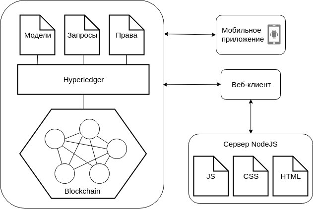

# BCDoc 

BlockChain Doctor


### BCDoc

- Команда: МГТУ им.Баумана, **shark_team**
- Ссылка нa проект: http://medics-client.herokuapp.com/


- Колотовкин Максим
- Кирьяненко Александр
- Куклина Нина
- Прохорова Злата
- Консультант - **Попов А.Ю.**

---

### Актуальность

- Данные невозможно удалить и изменить
- Врач имеет возможность доказать правильность диагноза
- Врач не имеет возможности поставить диагноз при отсутствии необходимых диагностических данных
- Врач не сможет выписать лекартственные препараты, вызывающие серьезные противопоказания или несовместимые лекарства
- Появляется возможность аналитически обработать информацию о многих пациентах

### Решение

- **Hyperledger**
- NodeJS
- Webpack
- JavaScript
- jQuery



### Приложения

- Web-приложение http://medics-client.herokuapp.com/
- Android-приложение


# Useful links

Hyperledger Composer Online Playground:
https://composer-playground.mybluemix.net

Hyperledger Composer API: 
https://hyperledger.github.io/composer/unstable/jsdoc/index.html

Hyperledger Composer Tutorials:
https://hyperledger.github.io/composer/latest/tutorials/developer-tutorial

Hyperledger Composer Modelling Language:
https://hyperledger.github.io/composer/latest/reference/cto_language

Hyperledger Composer ACL Language:
https://hyperledger.github.io/composer/latest/reference/acl_language

Hyperledger Composer Queries:
https://hyperledger.github.io/composer/latest/reference/query-language


# Install software

## Docker

### Mac

https://download.docker.com/mac/stable/Docker.dmg

### Ubuntu

https://docs.docker.com/install/linux/docker-ce/ubuntu/#os-requirements

## Docker compose

https://docs.docker.com/compose/install/

## NodeJS (with npm)

https://nodejs.org/en/download/

## Hyperledger Composer tools

```shell
npm install -g composer-cli
npm install -g composer-playground
npm install -g composer-rest-server
```

## Download required images

```shell
cd setup
./downloadFabric.sh
```

## Start Fabric network

```shell
./startFabric.sh
```

## Create Composer admin card

```shell
./createPeerAdminCard.sh
```

## Start Hyperledger Composer playground

```shell
composer-playground
```

## Start Composer REST Server

```shell
composer-rest-server
```
Provide your network card name.
Choose `never use namespaces`.
Then `N`, `N` and `N`.

